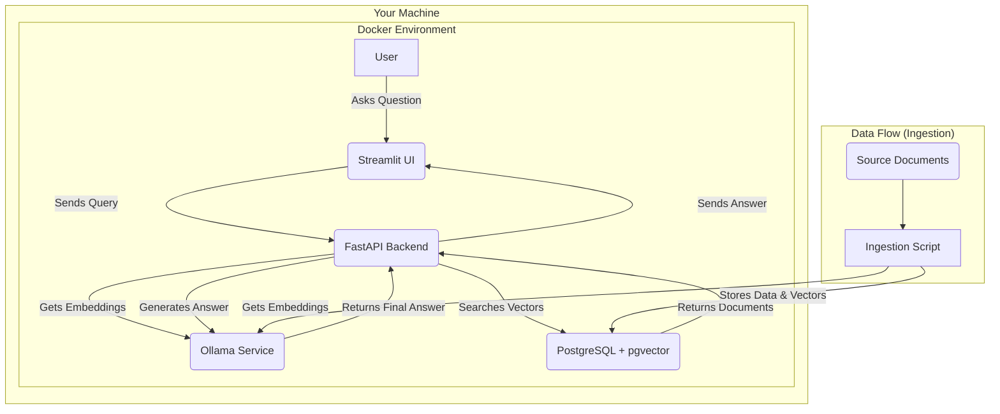
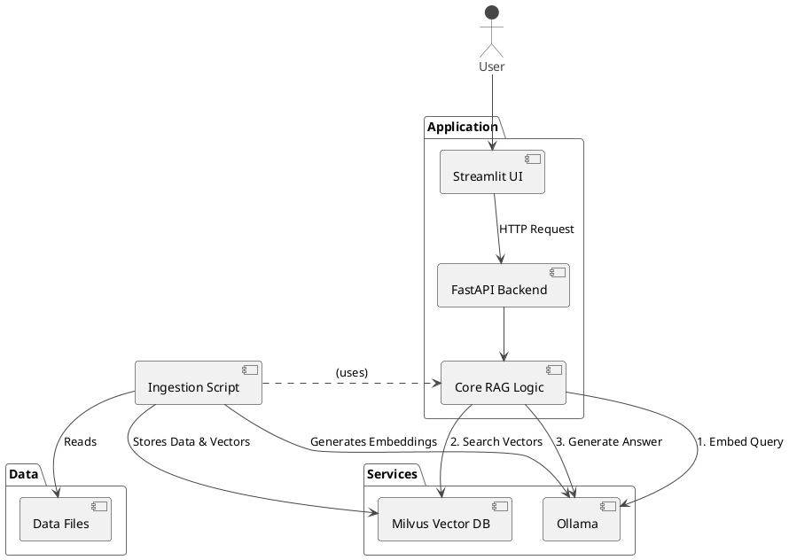

# RAG-Forge Developer Guide

This guide provides a deep dive into the architecture and components of the RAG-Forge project. It's intended for developers who want to understand, modify, or extend the application.

## Core Architecture

The project is designed with a "local-first" philosophy, ensuring that all data processing and AI model interactions happen on your local machine. It consists of three main services orchestrated by Docker Compose.

### Architectural Diagram



### Services

*   **`app` (RAG-Forge Application)**:
    *   This is the main container that runs the entire RAG application.
    *   **FastAPI Backend (`src/main.py`)**: A robust API server that handles requests from the UI, orchestrates the RAG pipeline, and interacts with other services.
    *   **Streamlit UI (`src/ui.py`)**: A user-friendly web interface for asking questions and viewing answers.
    *   **Core Logic (`src/core.py` & `src/ingestion/`)**: The Python code responsible for data ingestion, embedding, retrieval, and generation.

*   **`postgres` (Database)**:
    *   This service runs a PostgreSQL database with the `pgvector` extension enabled.
    *   It serves as a unified data store for both the vector embeddings and the associated text content, allowing for powerful queries that combine traditional SQL filtering with vector similarity search.

*   **`ollama` (LLM & Embedding Service)**:
    *   This service runs Ollama, which provides easy access to open-source Large Language Models.
    *   It serves two purposes: generating the vector embeddings for documents and queries, and generating the final answer based on the retrieved context.

## The RAG Pipeline in Detail

### 1. Ingestion (`src/ingestion/` & `src/main.py`)

Data ingestion is handled exclusively via a `POST /upload` API endpoint, which gives you full control over when and what gets added to the knowledge base.

1.  **Trigger**: An external script (like the example in `scripts/upload_document.py`) sends a file to the `/upload` endpoint.
2.  **Process**: The API receives the file, splits it into smaller text chunks, and connects to the `ollama` service to convert each chunk into a vector embedding.
3.  **Store**: The API then connects to the `postgres` database, deletes any existing chunks with the same source filename, and inserts the new data. This makes the process idempotent.

### 2. Retrieval & Generation (`src/core.py`)

This is the heart of the application, triggered whenever a user asks a question.

1.  **Embed Query**: The user's question is converted into a query vector using the same embedding model.
2.  **Search PostgreSQL**: This query vector is used to search the `documents` table in PostgreSQL. `pgvector` efficiently finds the most "similar" text chunks from the database by comparing their vectors.
3.  **Construct Prompt**: The most relevant chunks are retrieved and placed into a prompt template along with the original question. This provides the LLM with the necessary context.
4.  **Generate Answer**: The final prompt is sent to the `ollama` service, which uses a powerful LLM to generate a human-readable answer based on the provided context.
5.  **Return Response**: The answer and the source documents are sent back to the UI to be displayed to the user.

## Vision

The goal of RAG-Forge is to create an expert AI assistant for an API ecosystem. It's designed to answer developer questions by using a knowledge base of API specifications, documentation, and best practices, ultimately providing solution designs and code examples.

## High-Level Architecture

The entire application is a set of interconnected services managed by Docker Compose. This makes setup and development consistent across different machines.

Here is a simplified view of the component interactions:



### Service Breakdown

-   **rag-forge-app**: This is the main application container where our Python code lives. It houses three key components:
    1.  **FastAPI Backend**: A robust API that exposes the core RAG functionality.
    2.  **Streamlit UI**: A simple, user-friendly web interface for interacting with the assistant.
    3.  **Ingestion Script**: A script that runs at startup to process and load data into our vector database.
-   **ollama**: This service hosts the large language models (LLMs). We use it for two critical tasks:
    1.  **Generating Embeddings**: Converting text chunks into numerical vectors.
    2.  **Generating Answers**: Creating human-readable answers based on user questions and retrieved context.
-   **milvus**: This is our high-performance vector database. It stores the vectorized representations (embeddings) of our knowledge base and allows for incredibly fast similarity searches.
-   **milvus-etcd** & **milvus-minio**: These are essential dependencies for Milvus. `etcd` stores metadata, and `MinIO` provides object storage for the vector data itself. You can think of them as the "database" and "file system" for Milvus.

## Core Concepts: What is RAG?

RAG stands for **Retrieval-Augmented Generation**. It's a technique that makes LLMs "smarter" by giving them access to external knowledge. Instead of relying only on the data it was trained on, our model can pull in relevant, up-to-date information before answering a question.

Here's the workflow:

1.  **Retrieve**: When a user asks a question, we don't send it directly to the LLM. First, we search our Milvus database to find the most relevant pieces of text from our knowledge base (e.g., excerpts from API documentation).
2.  **Augment**: We take the user's original question and "augment" it by adding the relevant text we just retrieved. This combined text becomes a new, more detailed prompt.
3.  **Generate**: We send this augmented prompt to the LLM. With the added context, the model can generate a much more accurate and specific answer.

## Application Deep Dive

Let's look at the code inside the `rag-forge-app` container.

### Project Structure (`/src`)

-   `config.py`: A centralized file for all important configurations, such as model names, service hosts, and database settings. It reads from environment variables, allowing for easy adjustments without changing the code.
-   `ingestion/ingest.py`: This is where the magic of data preparation happens.
-   `core.py`: Contains the core logic for the RAG pipeline.
-   `main.py`: Defines the FastAPI backend and its API endpoints.
-   `ui.py`: Contains the code for the Streamlit user interface.

### The Data Ingestion Flow (`src/ingestion/ingest.py`)

This script runs automatically when the application starts. Its job is to populate the Milvus vector database.

1.  **Load Documents**: It starts by loading text files from the `/data` directory.
2.  **Chunk Text**: Documents are broken down into smaller, manageable chunks. This is crucial because LLMs have a limited context window, and smaller chunks lead to more precise search results.
3.  **Generate Embeddings**: Each text chunk is sent to the Ollama service to be converted into a vector embedding using the `dengcao/Qwen3-Embedding-0.6B:Q8_0` model.
4.  **Store in Milvus**: The script connects to Milvus and inserts the data: the original text chunk, its vector embedding, and any associated metadata (like the source document name).

### The API & RAG Logic (`src/main.py` & `src/core.py`)

This is the heart of the application, where user queries are processed.

1.  **API Endpoint**: `main.py` defines the `/api/v1/ask` endpoint, which receives the user's question from the Streamlit UI.
2.  **Query Processing**: The request is passed to the `query_rag` function in `core.py`, which executes the RAG flow:
    a.  **Embed Query**: The user's question is converted into a vector embedding using the same model as the documents.
    b.  **Search Milvus**: This query vector is used to search Milvus, which returns the most similar text chunks from its database.
    c.  **Construct Prompt**: A detailed prompt is created by combining the original question with the retrieved context chunks. This gives the LLM all the information it needs.
    d.  **Generate Answer**: The final prompt is sent to the `qwen3:1.7b` model in Ollama, which generates the final answer.
    e.  **Return Response**: The answer is sent back to the UI to be displayed to the user.

## How to Run & Develop

1.  **Start the Application**: From the project root, run:
    ```bash
    docker-compose up --build
    ```
2.  **Access the UI**: Open your browser to `http://localhost:8501`.
3.  **Access the API Docs**: The FastAPI backend provides interactive documentation at `http://localhost:8000/docs`. This is a great way to test the API directly.
4.  **Adding New Knowledge**: To add new documents to the knowledge base, simply place your `.md` or `.txt` files in the `/data` directory and restart the application. The ingestion script will automatically process them. 