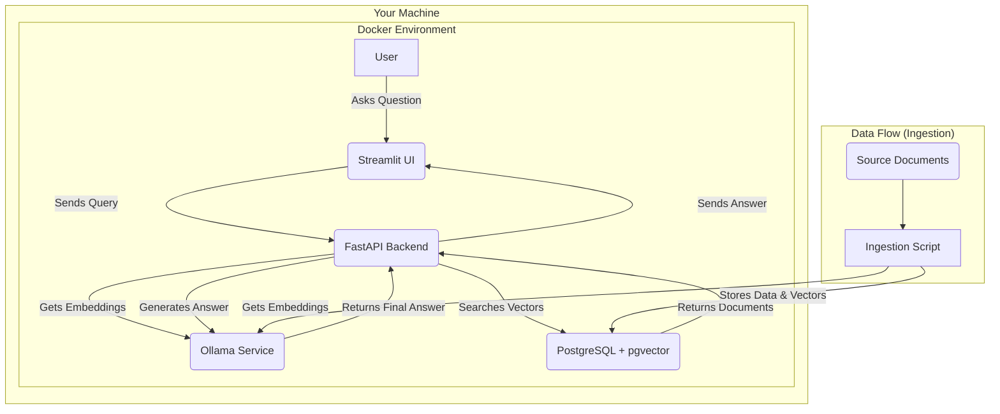

# RAG-Forge Developer's Guide

This document provides technical details for developers working on the RAG-Forge project.

## 🚀 Project Structure

The project is organized into several key directories:

-   `src/`: Contains the main application source code.
    -   `core.py`: Core RAG logic, including the QA chain and LLM provider factory.
    -   `main.py`: FastAPI application entry point and API endpoints.
    -   `ui.py`: Streamlit user interface code.
    -   `config.py`: Application configuration, loaded from environment variables.
    -   `ingestion/`: Logic for document processing and embedding.
    -   `models.py`: SQLAlchemy database models.
-   `scripts/`: Contains utility and helper scripts.
    -   `authenticate_github.py`: Handles the device auth flow for GitHub Copilot.
    -   `upload_document.py`: Client-side script for uploading documents.
-   `documents_to_ingest/`: A git-ignored directory for placing documents to be ingested.
-   `.secrets/`: A git-ignored directory for storing sensitive information, such as API tokens.
-   `docs/`: Project documentation, including ADRs.

## 🧠 LLM Provider Configuration

The application can be configured to use different Large Language Models (LLMs) for the generation step of the RAG pipeline. This is controlled by the `LLM_PROVIDER` environment variable.

### Environment Variables

-   `LLM_PROVIDER`: Determines which LLM to use.
    -   `ollama` (default): Uses a local Ollama instance. The specific model is determined by the `LLM_MODEL` variable.
    -   `github_copilot`: Uses the GitHub Copilot API.

-   `GITHUB_COPILOT_TOKEN_PATH`: The path to the file containing the GitHub Copilot access token. This is used when `LLM_PROVIDER` is set to `github_copilot`. Inside the Docker container, this path is `/app/.secrets/github_token.json`.

### Core Logic (`src/core.py`)

The `get_llm()` factory function in `src/core.py` is responsible for instantiating the correct LangChain LLM class based on the `LLM_PROVIDER` environment variable.

-   If the provider is `ollama`, it returns a `langchain_community.chat_models.ollama.OllamaLLM` instance, using the `LLM_MODEL` variable.
-   If the provider is `github_copilot`, it reads the token from the path specified by `GITHUB_COPILOT_TOKEN_PATH` and returns a `langchain_openai.ChatOpenAI` instance configured with the appropriate API base URL, the loaded token, and the `GITHUB_COPILOT_MODEL` variable.

### GitHub Copilot Authentication

To use GitHub Copilot, developers must first run the authentication script:

```bash
./authenticate.sh
```

This script handles the OAuth 2.0 device flow and stores the resulting access token in `.secrets/github_token.json`, which is read by the application at runtime.

## 🐳 Docker Development

The `docker-compose.yml` file is configured for development.

-   The `src` directory is mounted as a volume, allowing for live code reloading.
-   The `.secrets` directory is also mounted to provide the GitHub Copilot token to the containerized application.
-   To switch LLM providers, modify the `LLM_PROVIDER` environment variable in the `app` service definition within the `docker-compose.yml` file.

## Vector Store

We use PostgreSQL with the `pgvector` extension for storing document embeddings. The connection is managed via SQLAlchemy. The database schema is defined in `src/models.py`.

## Core Architecture

The project is designed with a "local-first" philosophy, ensuring that all data processing and AI model interactions happen on your local machine. It consists of three main services orchestrated by Docker Compose.

### Architectural Diagram



### Services

*   **`app` (RAG-Forge Application)**:
    *   This is the main container that runs the entire RAG application.
    *   **FastAPI Backend (`src/main.py`)**: A robust API server that handles requests from the UI, orchestrates the RAG pipeline, and interacts with other services.
    *   **Streamlit UI (`src/ui.py`)**: A user-friendly web interface for asking questions and viewing answers.
    *   **Core Logic (`src/core.py` & `src/ingestion/`)**: The Python code responsible for data ingestion, embedding, retrieval, and generation.

*   **`postgres` (Database)**:
    *   This service runs a PostgreSQL database with the `pgvector` extension enabled.
    *   It serves as a unified data store for both the vector embeddings and the associated text content, allowing for powerful queries that combine traditional SQL filtering with vector similarity search.

*   **`ollama` (LLM & Embedding Service)**:
    *   This service runs Ollama, which provides easy access to open-source Large Language Models.
    *   It serves two purposes: generating the vector embeddings for documents and queries, and generating the final answer based on the retrieved context.

## The RAG Pipeline in Detail

### 1. Ingestion (`src/ingestion/` & `src/main.py`)

Data ingestion is handled exclusively via a `POST /upload` API endpoint, which gives you full control over when and what gets added to the knowledge base.

1.  **Trigger**: An external script (like the example in `scripts/upload_document.py`) sends a file to the `/upload` endpoint.
2.  **Process**: The API receives the file, splits it into smaller text chunks, and connects to the `ollama` service to convert each chunk into a vector embedding.
3.  **Store**: The API then connects to the `postgres` database, deletes any existing chunks with the same source filename, and inserts the new data. This makes the process idempotent.

### 2. Retrieval & Generation (`src/core.py`)

This is the heart of the application, triggered whenever a user asks a question.

1.  **Embed Query**: The user's question is converted into a query vector using the same embedding model.
2.  **Search PostgreSQL**: This query vector is used to search the `documents` table in PostgreSQL. `